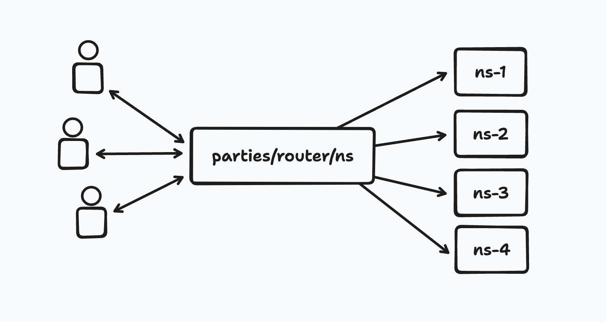

## 🎈 example-sharding

Welcome to the party, pal!

[Partykit](https://partykit.io) simplifies developing multiplayer applications by making it easy to build real-time WebSocket servers. 

Each PartyKit room can handle up to tens of thousands of simultaneous connections [with the help of hibernation](https://docs.partykit.io/guides/scaling-partykit-servers-with-hibernation/), but to scale beyond what a single server can handle, you can implement **sharding** by splitting your room across multiple servers, and broadcasting messages to all of them.

This repository demonstrates a simple approach to sharding.

## How it works

This approach works by routing connections and request via a [router](src/router.ts) party.

The router does the following:
- Defines a range of rooms to split the traffic between
- When receiving a WebSocket connection, routes it to one of the rooms randomly
- When receiving a HTTP request, sends to to all of the rooms

This way, when a new client connects, they get allocated to one of the rooms, but all clients will receive all messages.



### How to use it

Add the [router](src/router.ts) party to your project, and add it to your [partykit.json](partykit.json):

```diff
{
  "name": "example-sharding",
  "main": "src/main.ts",
+  "parties": {
+    "router": "src/router.ts"
+  }
}
```

To start receiving broadcasts, route WebSocket connections via the router party:
```diff
const conn = new PartySocket({
  host: PARTYKIT_HOST,
+  party: "router",
  room: "your-room",
});
```

To broadcast data to all clients, instead of sending data over WebSockets, send HTTP requests to the router party, which will then broadcast them to all shards:
```diff
- conn.send(JSON.stringify(data))
+ fetch(`http://${PARTYKIT_HOST}/parties/router/` + namespace, {
+   method: "POST",
+   body: JSON.stringfy(data)
+ });
```

The [main](src/main.ts) party doesn't need to be aware of the router, and operate normally, including:
- handling connections in its `onConnect` handler
- receiving messages in its `onRequest` handler
- broadcasting messages normally using `this.party.broadcast`

The only exceptions are:
- the room id includes the shard number, so for `room: "my-room"`, the server will have id `"my-room-1"`, `"my-room-2"`, etc.
- if a client sends messages directly to the room via `socket.send`, these will be received in the `onMessage` handler only in that shard, and not in the other shards.

## Areas of improvement

### Load balancing 

The load balancing approach in this example is naive: requests are split between rooms randomly. This will work to reduce load in each individual room, but 

Consider implementing a more robust load balancing algorithm based on your needs.

### Error handling and retries

This example code does not do a good job handling errors and retrying failed messages. This means that clients in different shards may miss some messages.

Consider implementing a robust retry mechanism with at-least-once delivery guarantee.

## Limitations

This approach relies on WebSocket broadcasts being used only for listening data, and all writes must happen via regular HTTP requests.

It's possible to shard writes via websockets, but the implementation would be more complicated. Socket messages cannot be intercepted in the router, so the room receiving the message would have to forward them to all other rooms, which makes the network topology messier.


